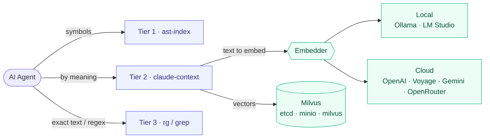
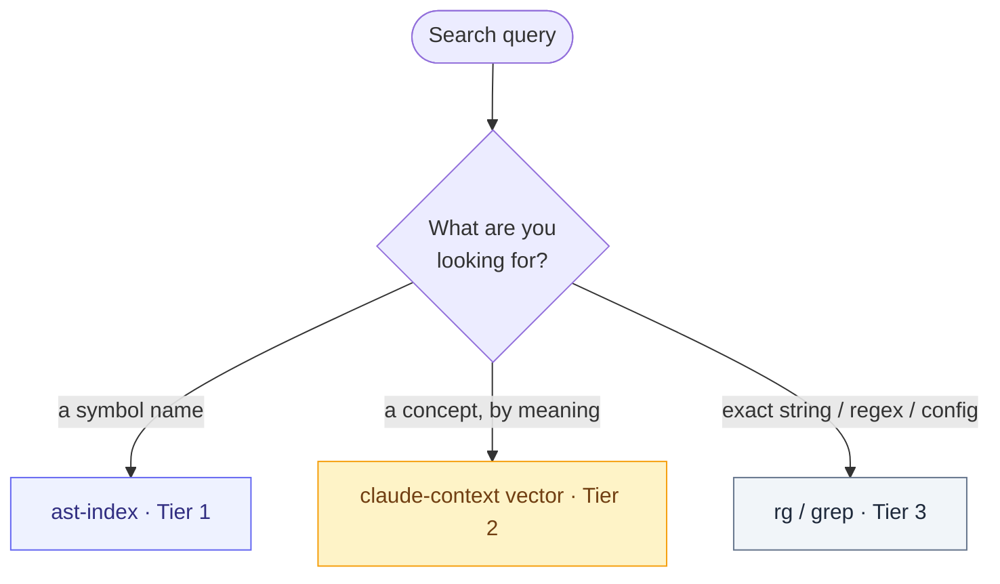

# ultimate-ai-local-search

One-command **local code search for AI coding agents** — three complementary tiers, no lock-in:

| Tier | Tool | Best for |
|------|------|----------|
| 1 | **ast-index** | symbols & structure — classes, functions, usages, call-tree (fast, exact) |
| 2 | **claude-context + Milvus** | semantic "find by meaning" — concepts when you don't know the symbol name |
| 3 | **rg/grep** | exact text — strings, regex, error messages, non-code files |

Embeddings can run **fully local** (Ollama / LM Studio) or via a **cloud provider** (OpenAI / VoyageAI / Gemini / OpenRouter) — you choose at install time. "Local" in the name = the vector DB and index live on your machine; the search never leaves it unless you pick a cloud embedder.

> Why it exists: wiring claude-context + Milvus + a local embedder by hand is a minefield — the classic failure is an **embedding-dimension mismatch** that makes every insert silently fail (indexing reports "done", search returns nothing). This repo encodes the working setup and a **smoke test that catches that bug at install time**.

## Quick start

```bash
git clone https://github.com/zhimbura/ultimate-ai-local-search.git
cd ultimate-ai-local-search
./install.sh            # interactive: pick a provider
# or non-interactive:
./install.sh --provider ollama --yes
```

Windows (PowerShell, Docker Desktop + WSL2):

```powershell
powershell -ExecutionPolicy Bypass -File .\install.ps1
```

The installer: checks deps → installs/sets up your embedder → starts Milvus (Docker) → merges the `claude-context` MCP block into `~/.claude.json` (backup first) → runs a smoke test. Then **restart your agent** and index a project.

## Requirements

- **Docker** (Desktop / OrbStack / Engine) running — for Milvus.
- **Node.js 22+** (for `npx @zilliz/claude-context-mcp`; older versions fail with `ERR_REQUIRE_ESM`).
- macOS or Linux for `install.sh`; Windows via `install.ps1`.
- On **macOS**, Homebrew is used for `ast-index`/`jq`/`ollama`. On **Linux** none of that needs brew — `ast-index` is fetched as a prebuilt binary, Ollama via its install script, `jq`/`curl` via apt.

## Providers

| Choice | Provider | Default model | Dim | Notes |
|--------|----------|---------------|-----|-------|
| 1 | Ollama (local) | `nomic-embed-text` | 768 | headless, simplest, free |
| 2 | LM Studio (local) | `text-embedding-nomic-embed-text-v1.5` | 768 | OpenAI-compatible REST :1234 |
| 3 | OpenAI | `text-embedding-3-small` | 1536 | needs `OPENAI_API_KEY` |
| 4 | VoyageAI | `voyage-code-3` | 1024 | best quality for code |
| 5 | Gemini | `text-embedding-004` | 768 | needs `GEMINI_API_KEY` |
| 6 | OpenRouter | `openai/text-embedding-3-small` | 1536 | proxy to many providers |

Switch later by editing `.env` and re-running `./install.sh` (or `scripts/configure-mcp.sh`).

## How your agent uses it

Once the MCP is loaded, the agent has these tools:

- `index_codebase` — index a project (path = absolute root)
- `get_indexing_status` — progress / completion
- `search_code` — semantic search (Tier 2)

For Tier 1 it calls the `ast-index` CLI; for Tier 3, `rg`/`grep`. The routing policy lives in [`rules/`](rules/) — copy `rules/AGENTS.snippet.md` into your project's `AGENTS.md` (or the compact `rules/CLAUDE.snippet.md` into `CLAUDE.md`).

## Testing

- **Smoke test** — runs automatically at the end of `install.sh`. Verifies your model's embedding dimension matches the configured one, and that Milvus accepts inserts + search at that dimension. Re-run anytime:
  ```bash
  bash scripts/smoke-test.sh --env-file .env
  ```
- **Tier 1 (ast-index)** — `./scripts/ast-test.sh`. Builds an index over a sample project and asserts symbol search finds a known function/symbol. Skips cleanly if ast-index isn't installed.
- **Tier 2 end-to-end** — `./scripts/e2e-test.sh` (needs **Node.js 22+**). Creates a tiny sample project, indexes it through the **real claude-context MCP**, runs a semantic search ("retry with exponential backoff" → expects `retry.js`), asserts the hit, then cleans up index + files. Exercises the full agent path, not just Milvus.

## Managing the stack

```bash
docker compose --env-file .env ps         # status of etcd + minio + milvus
docker compose --env-file .env logs milvus
docker compose --env-file .env down       # stop (keeps indexed data)
./uninstall.sh                            # stop + remove MCP entry (keeps volumes)
./uninstall.sh --purge                    # also delete indexed vectors (irreversible)
```

## Troubleshooting

**Indexing says "completed" but `search_code` returns nothing (and Milvus `rowCount` is 0).**
This is the dimension-mismatch bug. The Milvus collection was created with one vector dimension, but your model emits another, so every insert is rejected. Diagnose:

```bash
# real model dimension (Ollama example)
curl -s --noproxy '*' http://127.0.0.1:11434/api/embeddings \
  -d '{"model":"nomic-embed-text","prompt":"test"}' | jq '.embedding|length'
# collection dimension
curl -s --noproxy '*' http://127.0.0.1:19530/v2/vectordb/collections/describe \
  -H 'Content-Type: application/json' -d '{"collectionName":"<name>"}' \
  | jq '.data.fields[] | select(.type|test("FloatVector")) | .params'
```

If they differ: set `EMBEDDING_DIMENSION` (and the correct `EMBEDDING_MODEL`) in `.env`, then
`./uninstall.sh --purge && ./install.sh` to recreate the collection. `scripts/smoke-test.sh` checks this for you.

> Gotcha for OpenAI-compatible providers: claude-context reads the model from **`EMBEDDING_MODEL`** (not `OPENAI_EMBEDDING_MODEL`). A wrong var name → it falls back to `text-embedding-3-small` (dim 1536) regardless of what your local server actually loads. The installer always sets `EMBEDDING_MODEL`.

**`localhost` flaky / connection hangs.** Use `127.0.0.1`, not `localhost` — on some machines `localhost` resolves to IPv6 `::1` first and stalls. All defaults here use `127.0.0.1`.

**Milvus won't go healthy.** It's three containers (etcd + minio + milvus); first boot can take 1–2 min. Check `docker compose --env-file .env logs milvus`.

**LM Studio: "No models loaded".** The embedding model must be loaded and the server running: `lms get <model>` then `lms server start`.

## Architecture — what goes where



## Picking a tier



## License

MIT © 2026 zhimbura. Bundles/configures third-party tools (ast-index, claude-context, Milvus, Ollama/LM Studio) under their own licenses.
